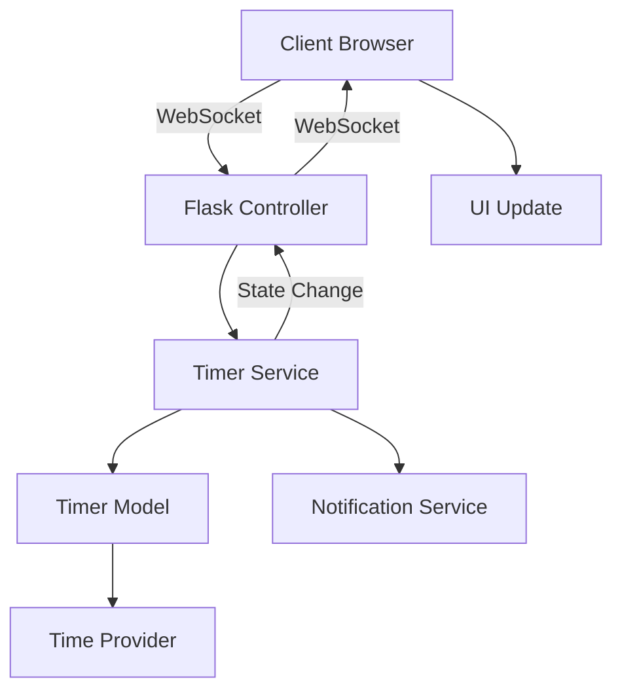

# ポモドーロタイマー Webアプリケーション アーキテクチャ設計書

## 📋 概要

本文書は、FlaskとHTML/CSS/JavaScriptを使用したポモドーロタイマーWebアプリケーションのアーキテクチャ設計をまとめたものです。テスタビリティとメンテナビリティを重視した設計となっています。

## 🏗️ アーキテクチャ概要

### 技術スタック
- **バックエンド**: Flask (Python 3.11+)
- **フロントエンド**: HTML5 + CSS3 + Vanilla JavaScript
- **リアルタイム通信**: Flask-SocketIO
- **データベース**: SQLite（設定保存用、オプション）
- **テストフレームワーク**: pytest
- **開発ツール**: Black, Flake8, mypy

### アーキテクチャパターン
- **レイヤードアーキテクチャ**: プレゼンテーション層、サービス層、モデル層の分離
- **依存性注入**: テスタビリティ向上のための外部依存の注入
- **オブザーバーパターン**: 状態変更の通知システム
- **ファクトリーパターン**: Flaskアプリケーションの生成

## 📁 プロジェクト構造

```
pomodoro-timer/
├── app.py                     # Flaskアプリケーションファクトリー
├── config.py                  # 設定管理
├── architecture.md            # アーキテクチャ設計書（本文書）
├── requirements.txt           # 本番依存関係
├── requirements-dev.txt       # 開発・テスト用依存関係
├── README.md                  # プロジェクト概要
├── .github/
│   └── workflows/
│       └── test.yml          # CI/CDパイプライン
├── src/                       # アプリケーションコード
│   ├── __init__.py
│   ├── models/                # ビジネスロジック層
│   │   ├── __init__.py
│   │   ├── interfaces.py     # 抽象インターフェース
│   │   ├── timer.py          # タイマーコアロジック
│   │   └── session.py        # セッション管理
│   ├── services/              # サービス層
│   │   ├── __init__.py
│   │   ├── timer_service.py  # タイマー操作サービス
│   │   └── notification_service.py # 通知サービス
│   ├── controllers/           # コントローラー層
│   │   ├── __init__.py
│   │   └── timer_controller.py # WebSocketハンドラー
│   └── utils/                 # ユーティリティ
│       ├── __init__.py
│       └── time_utils.py     # 時間関連ユーティリティ
├── tests/                     # テストコード
│   ├── __init__.py
│   ├── conftest.py           # pytest設定・フィクスチャ
│   ├── unit/                 # ユニットテスト
│   │   ├── test_timer.py
│   │   ├── test_session.py
│   │   └── test_services.py
│   ├── integration/          # 統合テスト
│   │   └── test_api.py
│   └── fixtures/             # テスト用データ
├── static/                   # 静的ファイル
│   ├── css/
│   │   └── style.css        # スタイルシート
│   ├── js/
│   │   ├── modules/         # モジュール分割
│   │   │   ├── timer.js     # タイマーロジック
│   │   │   ├── ui.js        # UI制御
│   │   │   └── websocket.js # WebSocket通信
│   │   └── app.js           # メインアプリケーション
│   └── assets/              # 画像、音声ファイル等
└── templates/               # HTMLテンプレート
    └── index.html          # メインページ
```

## 🔄 データフロー



1. **クライアント** → **Flask Controller** （WebSocket経由でタイマー操作）
2. **Controller** → **Timer Service** （ビジネスロジック処理）
3. **Service** → **Timer Model** （状態管理）
4. **Service** → **Notification Service** （通知処理）
5. **Service** → **Controller** （状態変更通知）
6. **Controller** → **クライアント** （WebSocket経由で状態更新）
7. **JavaScript** → **DOM更新** （UI反映）

## 🎯 コア機能

### 1. タイマー機能
- 25分の作業時間（ポモドーロ）
- 5分の短い休憩
- 15分の長い休憩（4ポモドーロ後）
- タイマーの開始/停止/リセット

### 2. UI コンポーネント
- 円形プログレスバー
- デジタル時間表示
- 制御ボタン（開始/停止/リセット）
- セッション数カウンター
- 現在のモード表示（作業/休憩）

### 3. 状態管理
- タイマー状態（作業中/休憩中/停止中）
- 経過時間と残り時間
- セッション数とサイクル管理

## 🧪 テスタビリティ設計

### 1. 依存性注入
```python
class PomodoroTimer:
    def __init__(
        self, 
        time_provider: TimeProviderProtocol,
        notification_service: Optional[NotificationServiceProtocol] = None
    ):
        # 外部依存を注入可能にしてテストでモック化
```

### 2. インターフェース分離
```python
class TimerStateProtocol(Protocol):
    def start(self) -> None: ...
    def stop(self) -> None: ...
    def reset(self) -> None: ...
    def get_remaining_time(self) -> int: ...
```

### 3. 時間の抽象化
```python
class MockTimeProvider:
    """テスト用の時間プロバイダー"""
    def advance_time(self, seconds: float):
        self._current_time += seconds
```

### 4. オブザーバーパターン
```python
class TimerService:
    def add_observer(self, callback):
        """テスト可能な状態変更通知"""
        self._observers.append(callback)
```

## 🔧 実装フェーズ

### フェーズ1: 基盤構築
1. プロジェクト構造の作成
2. Flask アプリケーションファクトリーの実装
3. 基本的なHTML/CSSレイアウト
4. 開発環境とテスト環境の構築

### フェーズ2: コアロジック
1. タイマーモデルの実装
2. サービス層の実装
3. ユニットテストの作成
4. 基本的なJavaScriptロジック

### フェーズ3: UI統合
1. WebSocket通信の実装
2. フロントエンドとバックエンドの統合
3. リアルタイムUI更新
4. 統合テストの作成

### フェーズ4: 機能拡張
1. 視覚効果とアニメーション
2. 音声通知
3. 設定のカスタマイズ機能
4. セッション履歴の保存

## 📊 テスト戦略

### 1. ユニットテスト
- **カバレッジ目標**: 90%以上
- **対象**: モデル、サービス、ユーティリティ
- **ツール**: pytest, pytest-cov

### 2. 統合テスト
- **対象**: API エンドポイント、WebSocket通信
- **ツール**: Flask test client, SocketIO test client

### 3. エンドツーエンドテスト
- **対象**: ユーザーシナリオ全体
- **ツール**: Selenium（必要に応じて）

### 4. テスト自動化
```yaml
# CI/CDパイプライン
- ユニットテスト実行
- カバレッジレポート生成
- コード品質チェック（Black, Flake8, mypy）
- セキュリティスキャン
```

## 🔒 セキュリティ考慮事項

1. **CSRF保護**: Flask-WTFを使用
2. **入力検証**: すべてのユーザー入力の検証
3. **セッション管理**: 安全なセッション設定
4. **HTTPS**: 本番環境でのHTTPS必須

## 📈 パフォーマンス考慮事項

1. **WebSocket接続**: 効率的な双方向通信
2. **メモリ管理**: タイマー状態の適切な管理
3. **フロントエンド最適化**: CSS/JSの最小化
4. **キャッシング**: 静的ファイルのキャッシング戦略

## 🚀 デプロイメント

### 開発環境
```bash
# 仮想環境の作成と依存関係インストール
python -m venv venv
source venv/bin/activate  # Windows: venv\Scripts\activate
pip install -r requirements-dev.txt

# 開発サーバーの起動
python app.py
```

### 本番環境
- **WSGI サーバー**: Gunicorn
- **リバースプロキシ**: Nginx
- **プロセス管理**: systemd
- **ログ管理**: 構造化ログとログローテーション

## 📚 参考リソース

- [Flask Documentation](https://flask.palletsprojects.com/)
- [Flask-SocketIO Documentation](https://flask-socketio.readthedocs.io/)
- [pytest Documentation](https://docs.pytest.org/)
- [ポモドーロテクニック](https://ja.wikipedia.org/wiki/ポモドーロ・テクニック)

## 🔄 今後の拡張可能性

1. **多言語対応**: i18n対応
2. **テーマ機能**: ダーク/ライトモード
3. **統計機能**: 生産性の可視化
4. **カレンダー連携**: スケジュール管理
5. **モバイルアプリ**: PWA対応
6. **チーム機能**: 複数ユーザー対応

---

**更新日**: 2025年10月24日  
**バージョン**: 1.0  
**作成者**: プロジェクトチーム